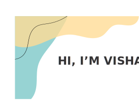
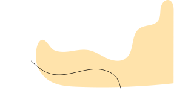

I love coding in Python :snake:. As a Python Developer I also occassionally participate in hackathons and community projects.

I am a recent graduate from :school: M S Ramaiah Uiversity of Applied Sciences, Banglore, Karnataka, India. My work is focused on developing products and researching in computer vision, deep learning and data science.

As a developer, I enjoy developing projects using my technical skills and engineering knowledge. My goal is to discover, analyze and manipulate — the power of 'data'. I'm currently looking for opportunities in machine learning teams in both full time and internship roles.

### Let's Connect :coffee:

	
	

