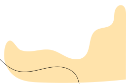

I love coding in Python :snake:. As a Python Developer I also occassionally participate in hackathons and community projects.

As a highly motivated and enthusiastic postgraduate student at University College Dublin who graduated with an MSc in Data and Computational Science degree, I am eager to apply my knowledge and skills to a challenging internship or full-time role. With relevant work experience in the field, I am confident in my ability to make valuable contributions to the company and continuously learn and grow in my role. I am excited to work with a team and contribute to the company's success. Additionally, I hold a Stamp 1G visa, which makes me eligible to work in Ireland, further enhancing my ability to contribute effectively to your organization. My work is focused on developing products and researching in computer vision, deep learning and data science.

As a developer, I enjoy developing projects using my technical skills and engineering knowledge. My goal is to discover, analyze and manipulate — the power of 'data'. I'm currently looking for opportunities in machine learning teams in both full time and internship roles.

### Let's Connect :coffee:

	
	

